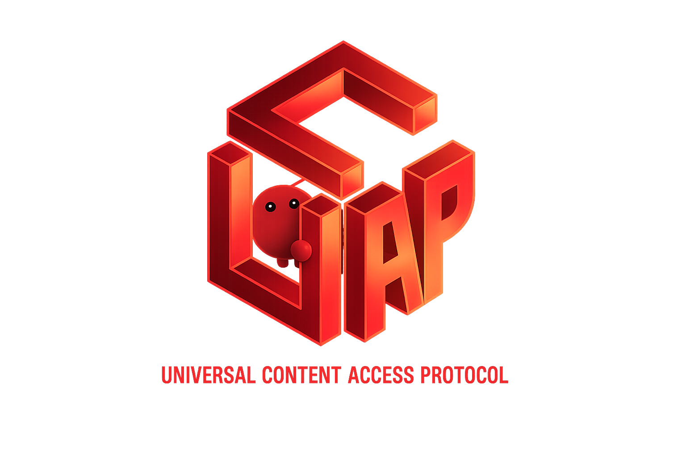

<p align="center">
  
</p>

<h3 align="center">Universal Content Access Protocol</h3>

<p align="center">
  The open standard for AI agents to access publisher content. Built on <a href="https://ucp.dev">UCP</a>.
</p>

<p align="center">
  <a href="https://github.com/Universal-Content-Access-Protocol/ucap/actions"></a>
  <a href="https://ucap.dev"></a>
  <a href="https://github.com/Universal-Content-Access-Protocol/ucap/blob/main/LICENSE"></a>
</p>

---

**UCAP** extends the [Universal Commerce Protocol (UCP)](https://ucp.dev) with capabilities purpose-built for content access — discovery, catalog search, entitlement-based reading, and subscription management. Where UCP handles commerce, UCAP handles content.

## Capabilities

| Capability | ID | Type |
|---|---|---|
| **Content Access** | `dev.ucap.content.access` | UCAP-native |
| **Catalog Search** | `dev.ucap.content.catalog.search` | UCAP-native |
| **Catalog Lookup** | `dev.ucap.content.catalog.lookup` | UCAP-native |
| **Identity Linking** | `dev.ucap.content.identity` | UCAP-native |
| **Subscription** | `dev.ucap.content.subscription` | UCP extension (extends `dev.ucp.shopping.checkout`) |

## How It Works

```
Agent requests content  ──►  UCAP Server checks entitlement
                                    │
                        ┌───────────┴───────────┐
                        ▼                       ▼
                   200 OK                  402 Payment
                (full content)           Required (offers)
                                              │
                                              ▼
                                    Agent presents checkout
                                      URL to human
                                              │
                                              ▼
                                    Human completes payment
                                              │
                                              ▼
                                    Entitlement minted ──► 200 OK
```

## Quick Links

- **[Documentation](https://ucap.dev)** — Full specification and guides
- **[Core Concepts](https://ucap.dev/documentation/core-concepts/)** — Design goals, roles, and terminology
- **[Specification](https://ucap.dev/specification/overview/)** — Technical spec with HTTP API details
- **[UCP](https://ucp.dev)** — The commerce protocol UCAP builds on

## Development

```bash
# Install dependencies
pip install mkdocs-material

# Serve docs locally
mkdocs serve

# Build
mkdocs build
```

## Contributing

We welcome contributions. Please open an issue or pull request.

## License

Apache 2.0
